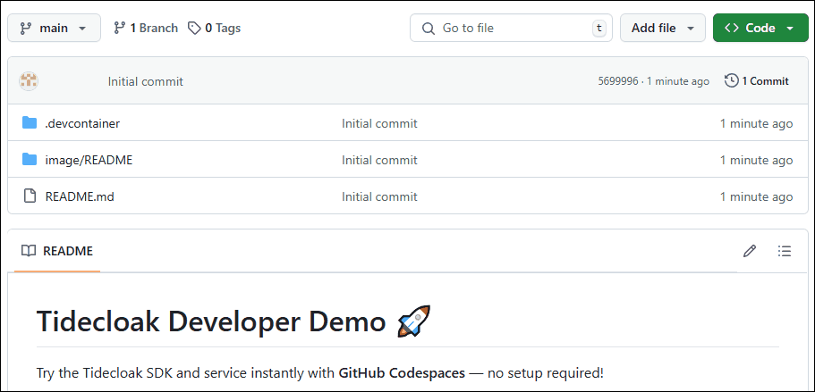
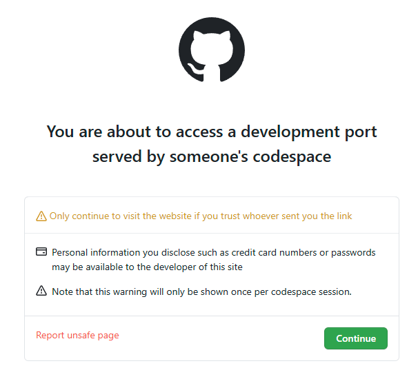

# Tidecloak Developer Demo 🚀

Try the Tidecloak SDK and service instantly with **GitHub Codespaces** — no setup required!

---

## **Launch the Environment** ✅

Click the button below to **fork**:

## After Forking: Launch the Codespace 🚀

✅ Now that you've forked the repo, launch your Codespace:

1. Go to **Code → Codespaces**
2. Select **"Create codespace in main"** on the `main` branch

**Grab a coffee, as this automated process can take around 7 mins to spin up**

---

## **What Happens Automatically** ▶️

Once the Codespace launches, it will:

- Clone the Tidecloak Next.js client app.  Full repos can be found [here](https://github.com/tide-foundation/tidecloak-client-nextJS)
- Install dependencies
- Create the `tidecloak.json` config
- Pull and run the **Docker service** (`tideorg/tidecloak-dev:latest`) with environment variables
- Start the Next.js app on port **3000**

**Ports auto-forward** — no manual setup needed! ✅
------------------------------------------------

**IMPORTANT: Make port 8080 public** to access the Tidecloak Admin UI

Go to the Ports tab in Codespaces, find port 8080, and right-click → 'Change port visibility' → 'Public'"

## **Access Your Running Services** 🌐

| Service                  | Description               | Example URL (Codespace)                           | Credentials |
| ------------------------ | ------------------------- | ------------------------------------------------- | -----------
| **Next.js App**    | SDK frontend demo         | `https://${CODESPACE_NAME}-3000.app.github.dev` | n/a              |
| **Docker Service** | Tidecloak backend service | `https://${CODESPACE_NAME}-8080.app.github.dev` | admin / password |

Once complete the Preview opens automatically or check the **Ports tab** in Codespaces for a direct address. ✅

When you click "Login" for the first time, you'll see the below Github warning. Just press continue to move on.

## **Automated Setup Progress** 🛠

| Step                | Description                                                                     |
| ------------------- | ------------------------------------------------------------------------------- |
| 🔧 [0/13]  | Installing required system libraries (e.g. OpenSSL)                             |
| 🚀 [1/13]  | Cloning the Tidecloak Next.js client repo                                       |
| 📦 [2/13]  | Installing frontend dependencies with `npm install`                           |
| 🌐 [3/13]  | Generating the dynamic Codespace URL for proper redirect and CORS handling      |
| 🔄 [4/13]  | Replacing `localhost:3000`with your live Codespace URL in `test-realm.json` |
| 🐳 [5/13]  | Pulling and launching the Tidecloak Docker container                            |
| ⏳ [6/13]  | Waiting for the Tidecloak service to become responsive                          |
| 🔐 [7/13]  | Fetching an admin token using the master realm                                  |
| 🌍 [8/13]  | Creating the `nextjs-test`realm using the Tidecloak Admin REST API            |
| 🛠️ [9/13]  | Running vendor setup (`setUpTideRealm`) and enabling IGA                      |
| ✅ [10/13] | Approving and committing all pending client change sets                         |
| 👤 [11/13] | Creating a test user in the newly created realm                                 |
| 📥 [12/13] | Fetching the OIDC adapter config and saving it to `tidecloak.json`            |
| 🎉 [13/13] | Setup complete — Next.js app is now fully integrated with Tidecloak            |

Your Next.js frontend secured by Tidecloak are now ready for testing and development. ✅
-----------------------------------------------------------------------------------------------------
